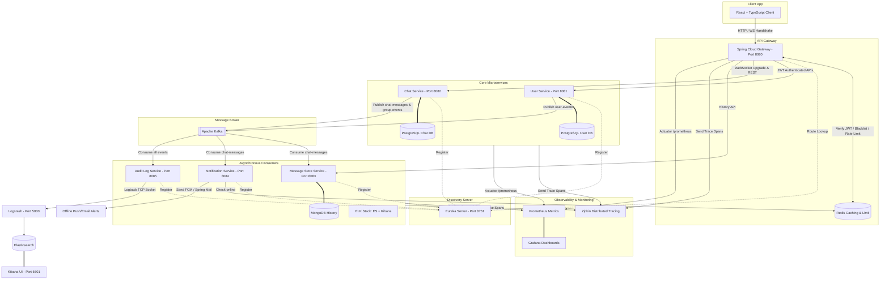

# 🚀 ECHO — Event-driven Chat & Hub Operations

ECHO (Event-driven Chat & Hub Operations) is a production-style, real-time messaging application designed with a **Java Spring Boot microservices architecture**, containerized via **Docker**, orchestrated using **Kubernetes (k8s)**, and structured around asynchronous event-driven pipelines utilizing **Apache Kafka**.

---

## 🏗️ Architecture Overview

The following diagram illustrates the microservices topology, request routing, event-driven flows, and monitoring layers of the system:



---

## 🛠️ Tech Stack & Badges

*   **Language:** 
*   **Backend Framework:** 
*   **Service Registry & Gateway:** Spring Cloud Netflix Eureka & Spring Cloud Gateway
*   **Real-Time:** 
*   **Security:** Spring Security 6 & JWT (`jjwt` 0.12.x)
*   **Message Broker:** 
*   **Databases:**
    *    (relational metadata)
    *    (AES-256 encrypted message documents)
    *    (online status, blacklisting)
*   **Monitoring & Logging:** ELK Stack, Prometheus, Grafana, Micrometer, and Zipkin
*   **Frontend:** React 19, TypeScript, Tailwind CSS v4, SockJS

---

## 🎛️ Environment Variables

| Variable | Default Value | Purpose |
| :--- | :--- | :--- |
| `POSTGRES_HOST` | `localhost` | PostgreSQL server hostname |
| `MONGO_HOST` | `localhost` | MongoDB host connection |
| `REDIS_HOST` | `localhost` | Redis server hostname |
| `KAFKA_BOOTSTRAP_SERVERS` | `localhost:29092` | Kafka cluster bootstrap nodes |
| `JWT_SECRET` | `3c9e4e2d4a2f4c3...` | HS256 JWT key (min. 32 bytes) |
| `ECHO_AES_KEY` | `abcdefghijklm...` | Symmetric key for MongoDB encryption (exactly 32 bytes) |
| `ZIPKIN_HOST` | `localhost` | Zipkin span collection server |

---

## 🚀 Getting Started

### 1. Prerequisite Checklist
Ensure you have the following installed on your machine:
*   Java JDK 17
*   Maven 3.9+
*   Node.js v20+
*   Docker & Docker Compose

### 2. Run Backing Infrastructure (Docker Compose)
From the root directory containing `docker-compose.yml`, launch the databases, broker, and tracing server:
```bash
docker compose up -d
```

To run the monitoring suite (Elasticsearch, Logstash, Kibana, Prometheus, Grafana):
```bash
# Note: Ensure the external network 'echo-network' exists (started by default compose)
docker compose -f docker-compose.monitoring.yml up -d
```

### 3. Build & Launch Microservices
Launch services in order (Discovery Server first):

```bash
# Compile and package all maven projects
mvn clean package -DskipTests

# Run Discovery Server (Port 8761)
java -jar discovery-server/target/discovery-server-1.0.0.jar

# Run API Gateway (Port 8080)
java -jar api-gateway/target/api-gateway-1.0.0.jar

# Run User Service (Port 8081)
java -jar user-service/target/user-service-1.0.0.jar

# Run Chat Service (Port 8082)
java -jar chat-service/target/chat-service-1.0.0.jar

# Run Message Store Service (Port 8083)
java -jar message-store-service/target/message-store-service-1.0.0.jar

# Run Notification Service (Port 8084)
java -jar notification-service/target/notification-service-1.0.0.jar

# Run Audit Log Service (Port 8085)
java -jar audit-log-service/target/audit-log-service-1.0.0.jar
```

### 4. Run React UI
Install packages and start the frontend local Vite dev server:
```bash
cd frontend
npm install
npm run dev
```
Open `http://localhost:5173` in your browser.

---

## 🚀 Kubernetes (k8s) Deployment

Apply all configurations, secrets, deployments, and routing manifests to your cluster:

```bash
# 1. Apply config configurations and secrets
kubectl apply -f k8s/configmaps/configmap.yaml
kubectl apply -f k8s/secrets/secret.yaml

# 2. Deploy services and applications
kubectl apply -f k8s/services/services.yaml
kubectl apply -f k8s/deployments/deployments.yaml

# 3. Apply horizontal pod autoscaler and ingress controller
kubectl apply -f k8s/hpa/chat-service-hpa.yaml
kubectl apply -f k8s/ingress/ingress.yaml
```

---

## ⚡ WebSocket and STOMP Testing Guide

To test the WebSockets flow manually, you can use the built-in React UI, or open the developer console (F12) on any page and test connection streams:

1.  **Handshake Connection:**
    Establish connection using SockJS pointing to: `ws://localhost:8080/ws` (routed via API Gateway).
2.  **Authentication Handshake:**
    Pass the JWT token as a connection header:
    ```javascript
    const headers = { Authorization: "Bearer " + jwtToken };
    stompClient.connect(headers, connectCallback);
    ```
3.  **Subscribing to Messages:**
    *   **Private Chat:** Subscribe to `/user/queue/messages` to receive direct messages.
    *   **Group Chat:** Subscribe to `/topic/group/{groupId}` to listen to messages sent in a group hub.
4.  **Publishing Messages:**
    *   **Send Private:** Publish JSON payload to `/app/chat.sendMessage`:
        ```json
        {
          "receiverId": "uuid-receiver",
          "senderUsername": "alex",
          "content": "Secret text message",
          "type": "PRIVATE"
        }
        ```
    *   **Send Group:** Publish JSON payload to `/app/group.sendMessage`:
        ```json
        {
          "groupId": "uuid-group",
          "senderUsername": "alex",
          "content": "Hello team!",
          "type": "GROUP"
        }
        ```

---

## 🔮 Future Scope
*   **Kubernetes Service Mesh:** Integrating Linkerd or Istio for secure mutual TLS communication between backend pods.
*   **Media Storage Hub:** Creating a dedicated Media Storage Service backed by MinIO or AWS S3 buckets to support photo, video, and file shares.
*   **WebRTC Integration:** Adding peer-to-peer audio and video calling directly in the chat panel.
